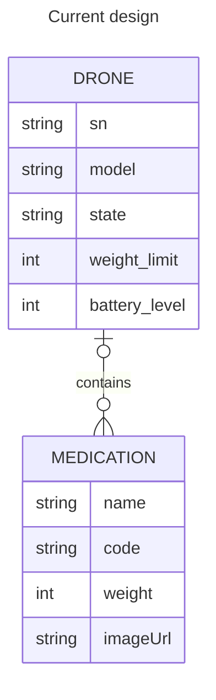
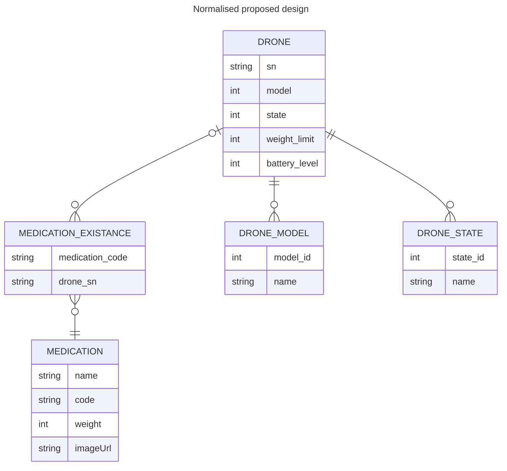

# Building instructions

For the sake of making this service more user-friendly, an already compiled version is provided
under [`Releases`](https://github.com/caputoortega/MusalaSoft-Drones/releases). 
In the event you want to modify the code and re-compile it you can follow the instructions below.

### Requirements
 - JDK 17 or greater
 - Apache Maven 3.6.3 or greater
 - Git

Step 1: Clone the repository into a folder by running:
 ```console
    git clone https://github.com/caputoortega/MusalaSoft-Drones.git
```
Step 2: `cd` into the directory by running
```console
   cd ./MusalaSoft-Drones
```
Step 3: Run the Maven's package goal. This will compile, test and generate a shaded artifact with all dependencies included.
```console
    mvn package
```

# Running instructions

You can run this service as any other Java programme, either by double-clicking (which will use the default settings and run in background)
or by the means of the `java` command in a prompt, being the latest one encouraged.

### Requirements
 - Java 17

### Parameters
| Parameter | Description                    | Value type | Aliases | Default value | Example usage           |
|-----------|--------------------------------|------------|---------|---------------|-------------------------|
| --apiHost | Binding IP address for the API | String     | -h      | 0.0.0.0       | --apiHost:187.22.61.223 |
| --apiPort | Binding port for the API       | Integer    | -p      | 8080          | --apiPort:80            |
| --dbName  | Database file name             | String     | -db     | drones        | --dbName:musalaDrones   |

#### Example run command with arguments:
```console
sudo java --jar drones-1.0.jar --apiHost:187.22.61.223 --apiPort:80 --dbName:musalaDrones
```

This will start the service and bind it to the address `187.22.61.223:80`, and all information will be stored in the
current directory under a file named `musalaDrones.mv.db` and `musalaDrones.trace.db`.

*Note that we are using `sudo` since any ports below 1000 are only bindable by root.*

## RESTful API

The API is designed to allow multiple version of the service being available simultaneously, for said reason,
the base endpoint structure looks as follows:

```
├── /api
│   ├── /<version>
│   │   ├── /drones
└── └── └── /medications
```

So, in case there's a version 1 and version 2 of the API running, requests can be sent to either of them by just
changing the version number:

```
├── /api
│   ├── /v1
│   │   ├── /drones
|   |   └── /medications
│   ├── /v2
│   │   ├── /drones
└── └── └── /medications
```

*Note: Version numbers are only mutable by altering the source code*.

### Endpoints

**!!! All endpoints are preceded by `/api/<version>` !!!**

Current API version: `v1`

#### Drone endpoints

*Replace __sn__ with the drone serial* 

| Endpoint                   | Method | Description                                       |
|----------------------------|--------|---------------------------------------------------|
| /drones                    | GET    | List all existing drones                          |
| /drones                    | POST   | Add a drone to the database                       |
| /drones/bulk               | POST   | Bulk add drones to the database                   |
| /drones/available          | GET    | List all drones available for loading medications |
| /drones/__sn__             | GET    | Get general information from a given drone        |
| /drones/__sn__/battery     | GET    | Get battery level from a given drone              |
| /drones/__sn__/items       | GET    | List all medications loaded on a given drone      |
| /drones/__sn__/items       | POST   | Load medications into a given given drone         |
| /drones/__sn__/items/bulk  | POST   | Bulk load medications into a given given drone    |
| /drones/__sn__/items       | DELETE | Unload a medication from the given drone          |
| /drones/__sn__             | DELETE | Delete the given drone from the database          |
| /drones/__sn__             | PATCH  | Update the given drone's information              |

#### Medication endpoints

*Replace __code__ with the medication code* 

| Endpoint               | Method | Description                                       |
|------------------------|--------|---------------------------------------------------|
| /medications           | GET    | List all existing medications                     |
| /medications           | POST   | Add a medication to the database                  |
| /medications/bulk      | POST   | Bulk add medication to the database               |
| /medications/__code__  | GET    | Get general information from a given medication   |
| /medications/__code__  | DELETE | Delete the given medication from the database     |
| /medications/__code__  | PATCH  | Update the given medication's information         |

# Testing

No external testing is required or provided since the artifact is tested on compile time.

If you need to run extra tests cases you can write some new ones under `ar.com.caputo.drones.test`
using [JUnit 5 Jupiter](https://junit.org/junit5/docs/current/user-guide/) (or any other library of your preference) 
following the [Maven Surefire Plugin instructions](https://maven.apache.org/surefire/maven-surefire-plugin/#:~:text=Requirements%3A%20Maven%203.2.5%20and,unit%20tests%20of%20an%20application.) and re-compile the artifact.

Keep in mind testing is done on random free ports and the database gets deleted automatically after the tests are completed. You can always
remove that functionality by editing the [`EndpointTest#teardown()`](https://github.com/caputoortega/MusalaSoft-Drones/blob/c4ef218430743ac5d9bde8b6fdd0a96645ae7cb5/src/test/java/ar/com/caputo/drones/test/EndpointTest.java#L73) method and commenting out the following lines:

```java
    Files.deleteIfExists(Path.of(System.getProperty("user.dir") + "/dronesTest.mv.db"));
    Files.deleteIfExists(Path.of(System.getProperty("user.dir") + "/dronesTest.trace.db"));
```


# Notes on possible future design improvements


## WIP



