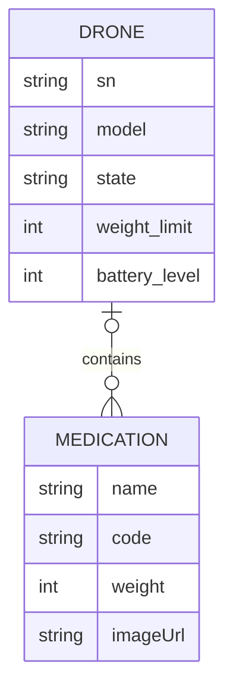
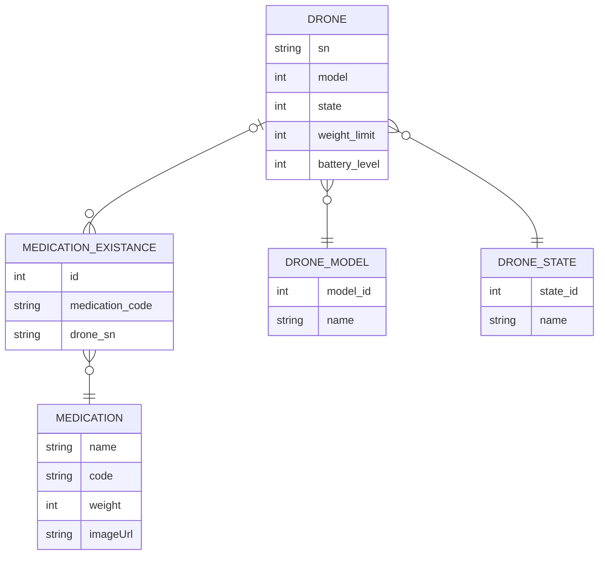
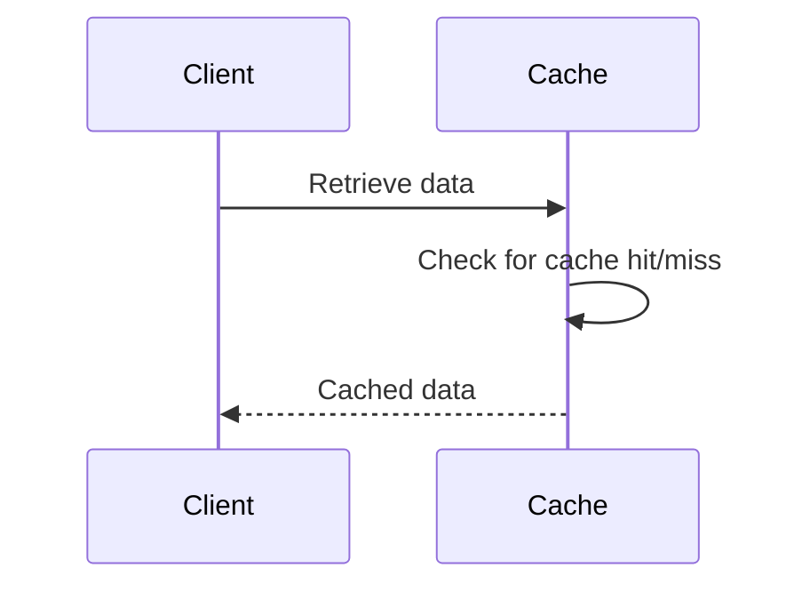
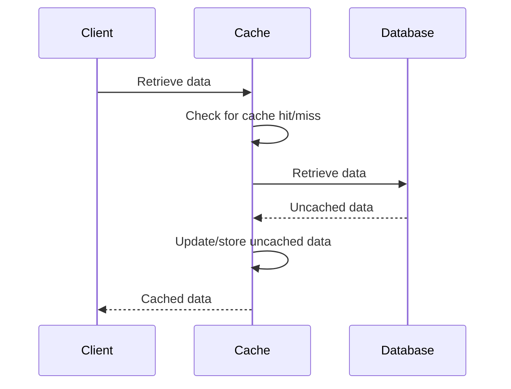

# Building instructions

For the sake of making this service more user-friendly, an already compiled version is provided
under [`Releases`](https://github.com/caputoortega/MusalaSoft-Drones/releases). 
In the event you want to modify the code and re-compile it you can follow the instructions below.

### Requirements
 - JDK 17 or greater
 - Apache Maven 3.6.3 or greater
 - Git

Step 1: Clone the repository into a folder by running:
 ```console
    git clone https://github.com/caputoortega/MusalaSoft-Drones.git
```
Step 2: `cd` into the directory by running
```console
   cd ./MusalaSoft-Drones
```
Step 3: Run the Maven's package goal. This will compile, test and generate a shaded artifact with all dependencies included.
```console
    mvn package
```

# Running instructions

You can run this service as any other Java programme, either by double-clicking (which will use the default settings and run in background)
or by the means of the `java` command in a prompt, being the latest one encouraged.

### Requirements
 - Java 17

### Parameters
| Parameter      | Description                              | Value type | Aliases | Default value | Example usage           |
|----------------|------------------------------------------|------------|---------|---------------|-------------------------|
| --apiHost      | Binding IP address for the API           | String     | -h      | 0.0.0.0       | --apiHost:187.22.61.223 |
| --apiPort      | Binding port for the API                 | Integer    | -p      | 8080          | --apiPort:80            |
| --dbName       | Database file name                       | String     | -db     | drones        | --dbName:musalaDrones   |
| --logInterval  | Time between battery level checks (secs) | Long       | -li     | 240           | --logInterval:15        |

#### Example run command with arguments:
```console
sudo java --jar drones-1.0.jar --apiHost:187.22.61.223 --apiPort:80 --dbName:musalaDrones --logInterval:15
```

This will start the service and bind it to the address `187.22.61.223:80`, and all information will be stored in the
current directory under a file named `musalaDrones.mv.db` and `musalaDrones.trace.db`. In addition, the service will 
check every 15 seconds the drones battery level and reset any of them on an invalid state

*Note that we are using `sudo` since any ports below 1000 are only bindable by root.*

# RESTful API

The API is designed to allow multiple version of the service being available simultaneously, for said reason,
the base endpoint structure looks as follows:

```
├── /api
│   ├── /<version>
│   │   ├── /drones
└── └── └── /medications
```

So, in case there's a version 1 and version 2 of the API running, requests can be sent to either of them by just
changing the version number:

```
├── /api
│   ├── /v1
│   │   ├── /drones
|   |   └── /medications
│   ├── /v2
│   │   ├── /drones
└── └── └── /medications
```

*Note: Version numbers are only mutable by altering the source code*.

## Endpoints

**!!! All endpoints are preceded by `/api/<version>` !!!**

Current API version: `v1`

### Drone endpoints

*Replace __sn__ with the drone serial* 

| Endpoint                   | Method | Description                                       |
|----------------------------|--------|---------------------------------------------------|
| /drones                    | GET    | List all existing drones                          |
| /drones                    | POST   | Add a drone to the database                       |
| /drones/bulk/              | POST   | Bulk add drones to the database                   |
| /drones/available/         | GET    | List all drones available for loading medications |
| /drones/__sn__             | GET    | Get general information from a given drone        |
| /drones/__sn__/battery     | GET    | Get battery level from a given drone              |
| /drones/__sn__/items       | GET    | List all medications loaded on a given drone      |
| /drones/__sn__/items       | POST   | Load medications into a given given drone         |
| /drones/__sn__/items       | DELETE | Unload a medication from the given drone          |
| /drones/__sn__             | DELETE | Delete the given drone from the database          |
| /drones/__sn__             | PATCH  | Update the given drone's information              |

**IMPORTANT**: Please note that endpoints `/drones/available/` and `/drones/bulk/` **contains a trailing slash!**
This is due to limitations with the SparkJava library which will treat anything without a trailing slash as an ID,
this way we can differentiate an argument endpoint (such as `/drones/__sn__`) from special endpoints such as the
above mentioned. 

#### Payload structure for Drones

The following are example payloads for ```/drones``` endpoints.
The order in which the fields are loaded is not important.

##### POST:`/drones`

```json
    {
        "serialNumber": "abc",
        "model": "LIGHTWEIGHT",
        "state": "IDLE",
        "weightLimit": 125,
        "batteryLevel": 75
    }
```

<hr>

##### POST:`/drones/bulk/`

```json
    {
        "bulk": 
         [
           {
            "serialNumber": "abc",
            "model": "LIGHTWEIGHT",
            "state": "IDLE",
            "weightLimit": 125,
            "batteryLevel": 75
           },
           {
            "serialNumber": "def",
            "model": "CRUISERWEIGHT",
            "state": "DELIVERED",
            "weightLimit": 383,
            "batteryLevel": 43
           },
           {
            "serialNumber": "ghi",
            "model": "HEAVYWEIGHT",
            "state": "DELIVERING",
            "weightLimit": 488,
            "batteryLevel": 64
           }           
         ]
    }
```

<hr>

#####  PATCH:`/drones/sn/`

In this PATCH request you can include any of the information fields you want to update
from the drone.

**IMPORTANT: The drone load cannot be updated from this endpoint.** 

Here are a couple examples:

```json
    {
        "serialNumber":"AEEAF2"
    }
```
This will update the serial number for the given drone to "`AEEAF2`".

```json
    {
        "model":"HEAVYWEIGHT",
        "weightLimit": 487
    }
```
This will update the model for the given drone to "`HEAVYWEIGHT`" and its weight limit to `487`.

```json
    {
        "serialNumber": "EEA2GG1",
        "status": "IDLE",
        "batteryLevel": 8
    }
```
This will update the serial number for the given drone to "`EEA2GG1`", set its state to `IDLE` and its battery level to `8`.

<hr>

#####  POST:`/drones/sn/items`

```json
    {
        "code": "AC331"
    }
```
This will load medication with code "`AC331`" to the given drone if exists and is not assigned to another unit

##### DELETE:`/drones/sn/items`

```json
    {
        "code": "AC331"
    }
```
This will unload/remove the medication with code "`AC331`" from the given drone if it was already loaded into the unit

<hr>


### Medication endpoints

*Replace __code__ with the medication code* 

| Endpoint               | Method | Description                                       |
|------------------------|--------|---------------------------------------------------|
| /medications           | GET    | List all existing medications                     |
| /medications           | POST   | Add a medication to the database                  |
| /medications/bulk/     | POST   | Bulk add medication to the database               |
| /medications/__code__  | GET    | Get general information from a given medication   |
| /medications/__code__  | DELETE | Delete the given medication from the database     |
| /medications/__code__  | PATCH  | Update the given medication's information         |


**IMPORTANT**: Please note that endpoint `/medications/bulk/` **contains a trailing slash!**
This is due to limitations with the SparkJava library which will treat anything without a trailing slash as an ID,
this way we can differentiate an argument endpoint (such as `/medications/__code__`) from special endpoints such as the
above mentioned. 


#### Payload structure for Medications

The following are example payloads for ```/medications``` endpoints.
The order in which the fields are loaded is not important.

##### POST:`/medications`

```json
    {
        "code": "TBP250",
        "name": "TERBIPRIN",
        "weight": 38
    }
```

<hr>

##### POST:`/medications/bulk/`

```json
    {
        "bulk": 
         [
           {
            "code":"CD125",
            "name":"CRODENU",
            "weight": 21
           },
           {
            "code":"BXN1000",
            "name":"BEXRANON",
            "weight": 73
           },
           {
            "code":"ADS500",
            "name":"ALDACSONE",
            "weight": 46
           }           
         ]
    }
```


#####  PATCH:`/medications/code/`

In this PATCH request you can include any of the information fields you want to update
from the medication.

**IMPORTANT: Assigning and updating the drone in which the medication is loaded cannot be done from this endpoint.** 

Here are a couple examples:

```json
    {
        "code":"CDX150"
    }
```
This will update the code for the given medication to "`CDX150`".

```json
    {
        "weight":33,
        "name": "CRODENUX"
    }
```
This will update the name for the given medication to "`CRODENUX`" and its weight to `33`.

```json
    {
        "code": "CDXD500",
        "name": "CRODENUX_DUO",
        "weight": 89
    }
```
This will update the code for the given medication to "`CDXD500`", set its name to `CRODENUX_DUO` and its weight to `89`.

<hr>

# Testing

No external testing is required or provided since the artifact is tested on compile time.

If you need to run extra tests cases you can write some new ones under `ar.com.caputo.drones.test`
using [JUnit 5 Jupiter](https://junit.org/junit5/docs/current/user-guide/) (or any other library of your preference) 
following the [Maven Surefire Plugin instructions](https://maven.apache.org/surefire/maven-surefire-plugin/#:~:text=Requirements%3A%20Maven%203.2.5%20and,unit%20tests%20of%20an%20application.) and re-compile the artifact.

Keep in mind testing is done on random free ports and the database gets deleted automatically after the tests are completed. You can always
remove that functionality by editing the [`EndpointTest#teardown()`](https://github.com/caputoortega/MusalaSoft-Drones/blob/c4ef218430743ac5d9bde8b6fdd0a96645ae7cb5/src/test/java/ar/com/caputo/drones/test/EndpointTest.java#L73) method and commenting out the following lines:

```java
    Files.deleteIfExists(Path.of(System.getProperty("user.dir") + "/dronesTest.mv.db"));
    Files.deleteIfExists(Path.of(System.getProperty("user.dir") + "/dronesTest.trace.db"));
```


# Notes on possible future design improvements


## Database design

Below it is provided an entity-relationship diagram of the database design as-is right now:



This design approach, although very simple to understand, contains major data
normalisation and data representation problems that will exponentially scale with the application.

The normalisation problem becomes clear when we look at fields such as `model` or `state` (from table `DRONE`) 
or `name` (from table `MEDICATION`). The fact that this fields are not normalised into their own tables presents
us with two challenges:

1) **Data inconsistency** introduced by *slightly* changed inputs -either conciously or accidentally-, such as
 capitalisation errors or typos.

    For fields like `model` and `state` this problem can be partially mitigated by using enumerators, but doesn't 
    protect the database against it when it is modified directly instead of using the service.
    
2) **Data duplication** is clearly present when we look at the `name` field from table `MEDICATION`.

    One might assume that this can easily be solved by the means of a `unique` constraint in the columns, but this
    is not a viable solution since the root issue is still present: **the data is not properly represented**. 

When we analise the requirements, a One-To-Many relationship between a `DRONE` and `MEDICATION` can quickly become caothic. 
For a **single** `MEDICATION` existance loaded to a **single** drone the design works flawlessly, but if we think of real-world
scenarios where a company may have many existances of the same medication, or where the same medication needs to be loaded into
different drones, this design approach falls apart in a wonderful combo for data-analysis and management disaster: multiple rows
of the same medication have to be stored, same name but different codes, and updating any fields for that medication turns from
a single database call to multiple calls -with the concern of not knowing whether all existances of the same medication have been
updated-.

For said reason, it is proposed that `MEDICATION` implements a Many-To-Many relationship with `DRONE` by using a intermediate table (`MEDICATION_EXISTANCE`) that represents an existance of a specific medication, that way, we can have a much better stock control
and mitigate the problems stated above.

Finally, and to reinforce the need for separate tables for `model` and `state`, the application is limited to the drone models and
states described by the enumerators, requiring to alter the code ever so slightly when a new model or state -`LOW BATTERY` for instance-
is required to be added. 

Below is a new entity-relationship diagram with the proposed changes that will help future-proof the application:




## Service security

In aims to keep the service demonstration simple no security measurements such as authentication has been developed.
This is, of course, for a publicly available service or a production environmennt a major concern.

For said reason it is recommended to add a basic authentication or token-bearer authentication features to prevent
unauthorised users and attackers gaining access and control over the service.

It is also recommended the usage of a more secure transfer protocol such as HTTPS or even the addition of a reverse-proxy
to encrypt the data in-transit.

Despite the support for file-level encryption and column-level encryption that H2 databases provide, a good addition will
be to migrate the project to a much more robust and secure database engine, with support for TDE and application-level 
encryption, examples of that are MySQL/MariaDB, MS SQL, Oracle or PostgreSQL.

## Performance improvements

As stated in the previous section, the service uses an H2 file-based database to store its information. This not only impacts
performance by limiting the time-to-access and time-to-write to the drive's speeds but can also slow down significatively
the response times if many operations are queued. 

To reduce this response times a hybrid model could be implemented, where the information is persisted into a traditional database
but also cached to memory -using in-memory caching systems such as *Redis* or *memcached*- for the most significant and commonly
requested data, this way the service's database hit count can be lowered by retrieving the cached information instead and the
overall performance is improved.

With that implementation, in the best-case scenario the most up-to-date version of the information has already been cached and the
user gets its response right-away. 



In the worst-case scenario the cache system contains outdated information or no information at all, which will require a couple
extra steps for database retrieval and cache update.


